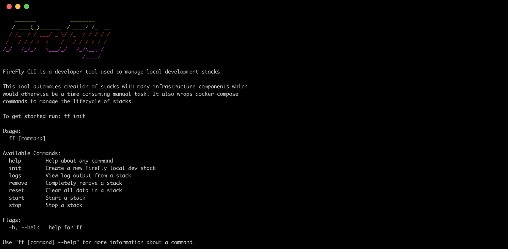
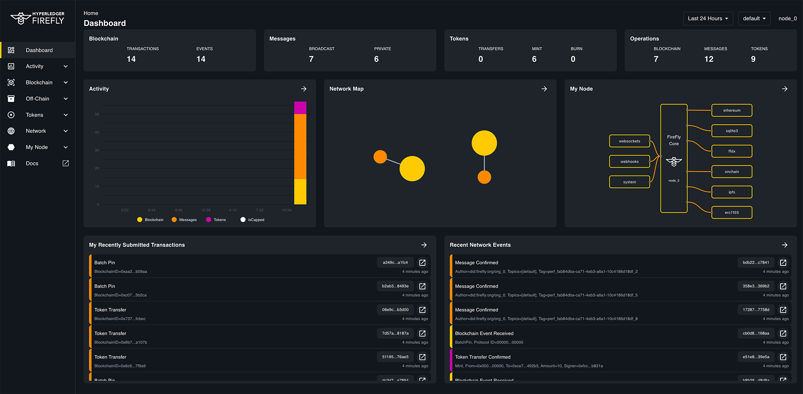
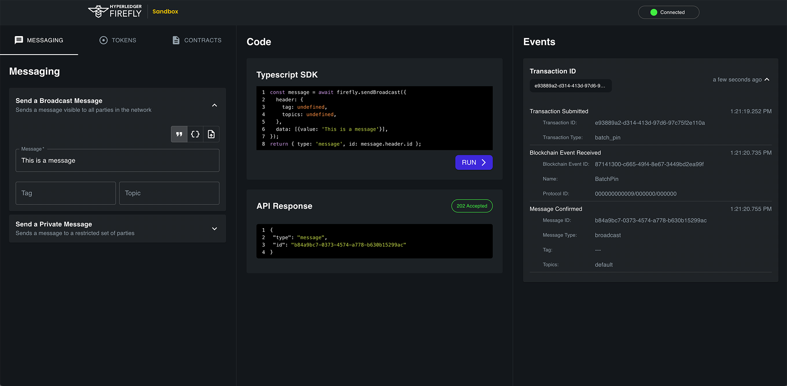

# Hyperledger FireFly

Hyperledger FireFly is the first open source Supernode: a complete stack for enterprises to build and scale secure Web3 applications.

The FireFly API for digital assets, data flows, and blockchain transactions makes it radically faster to build production-ready apps on popular chains and protocols.

[ENGLISH](./README.md) | [简体中文](./README_zh_CN.md)

## Start using Hyperledger FireFly

The best place to learn about FireFly is in the [documentation](https://hyperledger.github.io/firefly).

There you will find our [Getting Started Guide](https://hyperledger.github.io/firefly/latest/gettingstarted/),
which will get you a running FireFly network of Supernodes on your local machine in a few minutes.

Your development environment will come with:

FireFly CLI                   |  FireFly Explorer UI                | FireFly Sandbox  |
:----------------------------:|:-----------------------------------:|:----------------:|
 |  |  |

## Engage with the community

- [Join us on Discord](https://discord.gg/hyperledger)
- [Join our community calls](https://zoom-lfx.platform.linuxfoundation.org/meetings/firefly?view=list)

## Technical architecture

Hyperledger FireFly has a pluggable microservices architecture. Everything is pluggable, from the Blockchain technology,
token ERC standards, and custom smart contracts, all the way to the event distribution layer and private database.

So if there aren't yet instructions for making FireFly a Supernode for your favorite blockchain technology -
don't worry. There is almost certainly a straightforward path to plugging it in that will save you from re-building
all the plumbing for your blockchain application from scratch.

## Start contributing to Hyperledger FireFly

There are lots of places you can contribute, regardless of whether your skills are front-end, backend-end, or full-stack.

Check out our [Contributor Guide](https://hyperledger.github.io/firefly/latest/contributors/), and **welcome!**.

## Other repos

You are currently in the "core" repository, which is written in Go and hosts the API Server and central orchestration
engine. Here you will find plugin interfaces to microservice connectors written in a variety of languages like
TypeScript and Java, as well as heavy-lifting runtime components.

Other repositories you might be interested in containing those microservice components, user experiences, CLIs and samples.

> Note that only open source repositories and plugins are listed below

### Blockchain connectivity

- Transaction Manager - <https://github.com/hyperledger/firefly-transaction-manager>
- RLP & ABI encoding, KeystoreV3 utilities and secp256k1 signer runtime -  <https://github.com/hyperledger/firefly-signer>
- FFCAPI reference connector for EVM Chains - <https://github.com/hyperledger/firefly-evmconnect>
  - Public EVM compatible chains: Learn more in the [documentation](https://hyperledger.github.io/firefly)
- Permissioned Ethereum connector - <https://github.com/hyperledger/firefly-ethconnect>
  - Private/permissioned: Hyperledger Besu / Quorum
- Hyperledger Fabric connector - <https://github.com/hyperledger/firefly-fabconnect>
- Tezos connector - <https://github.com/hyperledger/firefly-tezosconnect>
- Cardano connector - <https://github.com/hyperledger/firefly-cardano>
- Corda connector starter: <https://github.com/hyperledger/firefly-cordaconnect>
  - CorDapp specific customization is required

### Token standards

- Tokens ERC20/ERC721 - <https://github.com/hyperledger/firefly-tokens-erc20-erc721>
- Tokens ERC1155 - <https://github.com/hyperledger/firefly-tokens-erc1155>

### Private data bus connectivity

- HTTPS Data Exchange - <https://github.com/hyperledger/firefly-dataexchange-https>

### Developer ecosystem

- Command Line Interface (CLI) - <https://github.com/hyperledger/firefly-cli>
- Explorer UI - <https://github.com/hyperledger/firefly-ui>
- Node.js SDK - <https://github.com/hyperledger/firefly-sdk-nodejs>
- Sandbox / Exerciser - <https://github.com/hyperledger/firefly-sandbox>
- Samples - <https://github.com/hyperledger/firefly-samples>
- FireFly Performance CLI: <https://github.com/hyperledger/firefly-perf-cli>
- Helm Charts for Deploying to Kubernetes: <https://github.com/hyperledger/firefly-helm-charts>
